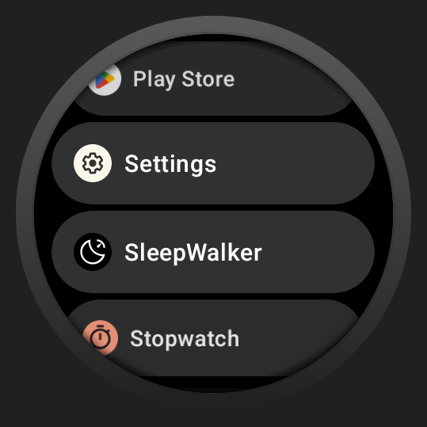
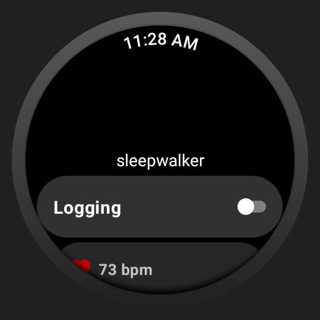
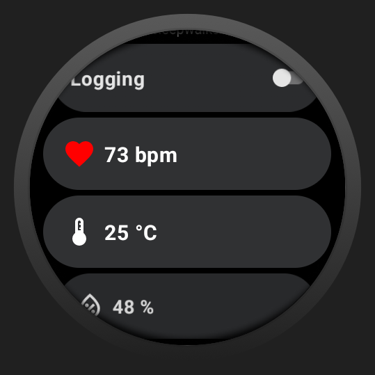
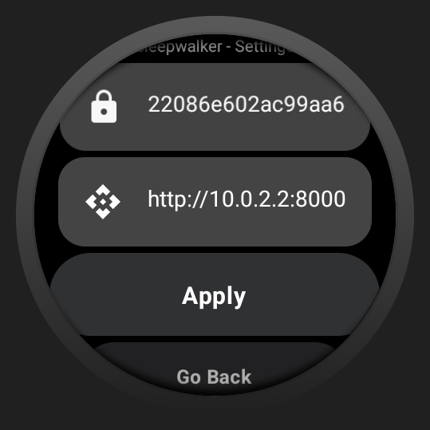
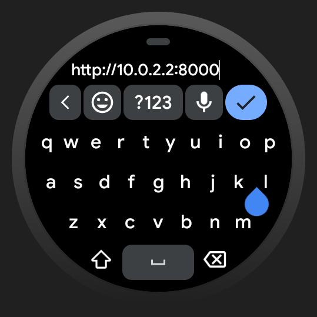

## Sleepwalker - WearOS

Part of [sleepwalker](https://github.com/zNitche/sleepwalker) project.
WearOS app for gathering sleep bio / movement data for `sleepwalker` system.

---

### Technologies
- Kotlin 1.9.0
- Retrofit 2.9.0

### Features
- Gathering body sensors data (Heart beat, movement).
- Gathering environment sensors data (temperature, humidity).
- Triggering vibrations when sleepwalking detected.

### Setup
1. Build `.apk` file
```
Build -> Generate Signed Bundle / APK -> APK
```

2. Install generated `.apk` file on your watch

### Usage
1. Open App





3. Scroll down, tab `Settings`
4. In `Settings` page fill API address and API key




6. Start logs session by clicking `Logging`
7. If system detects sleepwalking, vibrations will be triggered and `Rest` button will appear
